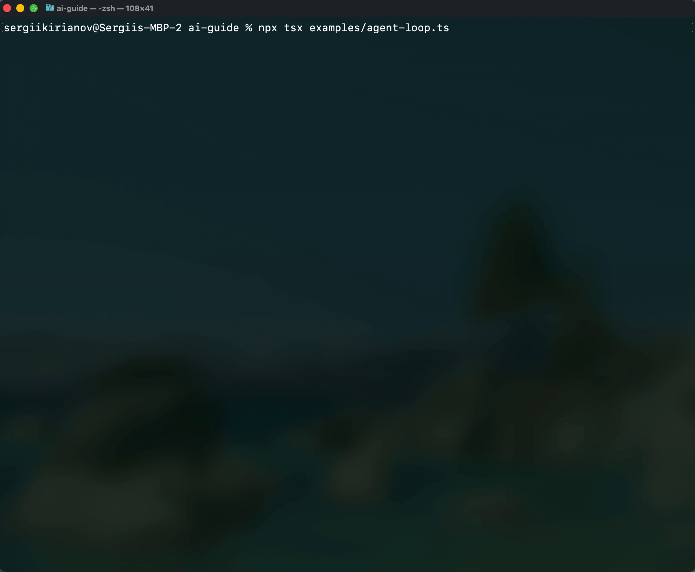

# dom-distill

Token-efficient DOM-to-tree distiller for LLMs and browser automation.



## The Problem

AI agents that browse the web (AutoGPT, Skyvern, browser-use, etc.) hit the same bottleneck: **bloated DOMs.**

A typical React/Next.js page has 2,000+ nodes. Serialize that and send it to an LLM, and you're burning **100k–180k tokens per step** — most of it hidden `<div>`s, `<svg>`s, and `<style>` tags the model can't act on anyway.

`dom-distill` is a zero-dependency TypeScript engine that runs inside the browser (`page.evaluate`) and converts the DOM into a minimal, structured JSON array of only the nodes an LLM needs to take action.

## Results

Live benchmarks running `dom-distill` against real sites via Playwright:

| Site | Raw Nodes | Raw Tokens | → Filtered Nodes | Filtered Tokens | **Reduction** |
|---|---|---|---|---|---|
| **GitHub** | 1,908 | ~147k | 115 | ~4.6k | **96.8%** |
| **Stripe** | 2,438 | ~180k | 192 | ~9.4k | **94.8%** |
| **React Docs** | 1,846 | ~68k | 139 | ~6.4k | **90.7%** |
| **Hacker News** | 807 | ~8.6k | 226 | ~10.2k | n/a (already minimal) |

## What the LLM Sees

Instead of 2,000 nodes of raw HTML, the LLM gets a clean array like this:

```json
[
  {
    "id": "dom-node-mmeytkdf-5",
    "text": "Acme Corp",
    "selector": "[data-testid=\"nav-home\"]",
    "rank": 6,
    "confidence": 1.0,
    "attributes": { "testId": "nav-home", "href": "/" }
  },
  {
    "id": "dom-node-mmeytkdf-12",
    "text": "Start free trial",
    "selector": "button[aria-label=\"Start free trial\"]",
    "rank": 3,
    "confidence": 0.7,
    "attributes": { "type": "button" }
  },
  {
    "id": "dom-node-mmeytkdf-21",
    "selector": "#email",
    "rank": 6,
    "confidence": 0.9,
    "attributes": { "name": "email", "placeholder": "you@example.com", "type": "email" }
  }
]
```

Each node includes:
- **`selector`** — Deterministic CSS selector the LLM can act on: `click("[data-testid=\"nav-home\"]")`
- **`rank`** — InteractionRank score (0–10+) based on tag semantics, ARIA roles, and attributes
- **`confidence`** — Selector stability score (0–1): how likely the selector survives DOM changes

## Install

```bash
npm install dom-distill
```

## Quick Start

### With Playwright

```typescript
import { chromium } from 'playwright';
import { readFileSync } from 'fs';

const browser = await chromium.launch();
const page = await browser.newPage();
await page.goto('https://example.com');

// Inject and run dom-distill in the browser context
const bundle = readFileSync('node_modules/dom-distill/dist/index.js', 'utf8');

const result = await page.evaluate((code) => {
  const exports = {};
  const module = { exports };
  new Function('exports', 'module', code)(exports, module);
  const { distill, filter } = module.exports;

  const tree = distill(document.body, { maxDepth: 15, maxNodes: 500 });
  return filter(tree, { minRank: 2 });
}, bundle);

console.log(result); // Clean, actionable nodes for your LLM
```

### In-Browser

```typescript
import { distill, filter, compress, diff } from 'dom-distill';

// 1. Distill the live DOM into a structured tree
const tree = distill(document.body, { maxDepth: 10, maxNodes: 500 });

// 2. Filter to high-value interactive elements
const nodes = filter(tree, { minRank: 2 });

// 3. Compress for LLM consumption (strips WeakRefs, parent refs)
const payload = compress(tree);

// 4. Incremental updates via diffing
const nextNodes = filter(distill(document.body), { minRank: 2 });
const delta = diff(nodes, nextNodes);
// → Only send delta.changed + delta.appeared to the LLM
```

## API

### Distillation

| Function | Description |
|---|---|
| `distill(root?, config?)` | Synchronous single-pass DOM → tree |
| `distillAsync(root?, config?)` | Chunked async traversal via `requestIdleCallback` (non-blocking) |
| `metrics(tree)` | Aggregate stats: node count, depth, branching factor, forms, nav |

### Filtering

| Function | Description |
|---|---|
| `filter(tree, config?)` | Keep only nodes with InteractionRank ≥ threshold |
| `filterAsync(tree, config?)` | Same, cooperatively scheduled |
| `calculateInteractionRank(node)` | Score a single node (0–10+) |

### Compression & Diffing

| Function | Description |
|---|---|
| `compress(tree)` | Strip runtime fields → JSON-serializable |
| `decompress(data)` | Reconstruct full tree from compressed data |
| `fingerprintNode(node)` | Stable hash for a single node |
| `fingerprintTree(nodes)` | Hash an entire node array |
| `diff(prev, next)` | Three-way delta: changed / appeared / disappeared |

### React Integration (tree-shakeable)

| Function | Description |
|---|---|
| `enhanceTreeWithFiber(tree)` | Walk React Fiber tree for component names, props, patterns |
| `findReactComponents(tree, name?)` | Find components by name |
| `getComponentHierarchy(node)` | Get the component ancestry path |
| `analyzeReactPatterns(tree)` | Count forms, modals, dropdowns, etc. |

## How It Works

- **Single-pass construction** — One DFS walk builds the tree with smart selectors, semantic tags, visibility checks, and action type detection.
- **InteractionRank scoring** — Each node scores 0–10+ based on tag semantics (`button` +3, `href` +3), ARIA roles (`role="button"` +2), and attributes. Invisible nodes score 0. Only high-ranking nodes survive filtering.
- **Selector confidence** — Every selector gets a stability score: `data-testid` → 1.0, `id` → 0.9, `name` → 0.8, `aria-label` → 0.7, structural `nth-of-type` → 0.3. Agents can use this to prefer stable selectors.
- **Cooperative scheduling** — `distillAsync` performs genuinely chunked traversal (stack-based DFS, yielding every 50 nodes via `requestIdleCallback`). No main-thread blocking, even on 10k+ node DOMs.
- **Fingerprint diffing** — Stable node hashes enable three-way diffs (changed / appeared / disappeared) for incremental LLM updates instead of full-tree resends.
- **React Fiber integration** — Optional `enhanceTreeWithFiber()` walks `__reactFiber$` internals to extract component names, sanitized props (passwords/API keys redacted), and structural patterns. Fully tree-shakeable — excluded from the bundle if not imported.

## Try It

Run the live demo against real websites:

```bash
git clone https://github.com/skirianov/dom-distill.git && cd dom-distill
npm install && npm run build
npm install --save-dev playwright tsx && npx playwright install chromium
npx tsx examples/demo.ts
```

Or point it at any URL:

```bash
npx tsx examples/demo.ts https://stripe.com
```

### AI Agent Cookbook

Build a complete browser agent that uses an LLM to decide actions:

```bash
# Set your API key (works with OpenRouter, OpenAI, or any compatible endpoint)
OPENROUTER_API_KEY=sk-or-... npx tsx examples/agent-loop.ts

# Custom task
OPENROUTER_API_KEY=sk-or-... npx tsx examples/agent-loop.ts "Go to github.com and find trending repositories"

# Use a different model
MODEL=anthropic/claude-sonnet-4 OPENROUTER_API_KEY=sk-or-... npx tsx examples/agent-loop.ts
```

The agent opens a **visible browser**, distills the page, asks the LLM what to do, executes the action, and repeats — so you can watch it work in real-time. See [`examples/agent-loop.ts`](examples/agent-loop.ts) for the full source (~180 lines).

## Zero Dependencies

No runtime dependencies. Pure TypeScript, browser APIs only. Ships ESM + CJS + full type declarations.

## License

MIT
